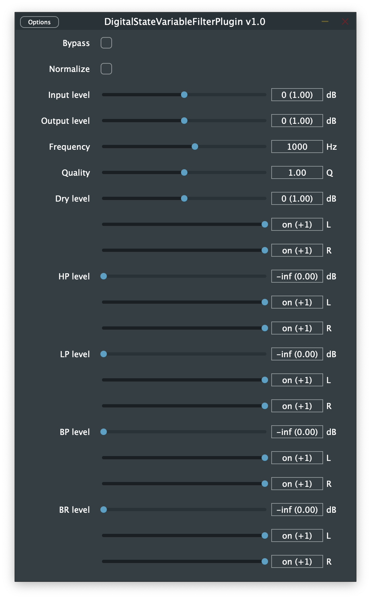

# Digital State Variable Filter Plugin

A [JUCE](https://github.com/juce-framework/JUCE) plug-in providing a tunable digital state variable filter bank according to [[1]](#1) and [[2]](#2).

## References

1. [Digital State-Variable Filters](https://kokkinizita.linuxaudio.org/papers/digsvfilt.pdf) by Fons Adriaensen
2. [Cookbook formulae for audio equalizer biquad filter coefficients](https://webaudio.github.io/Audio-EQ-Cookbook/audio-eq-cookbook.html) by Robert Bristow-Johnson

## License

*DigitalStateVariableFilterPlugin* is licensed under the terms of the GPL license.
For details please refer to the accompanying [LICENSE](LICENSE) file distributed with *DigitalStateVariableFilterPlugin*.
